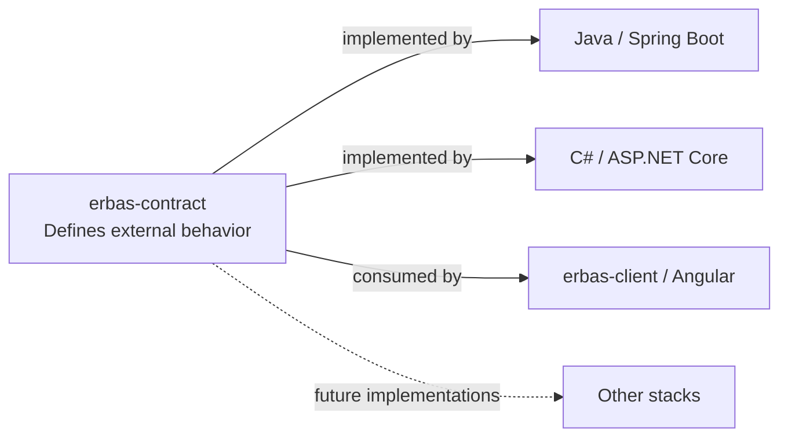

# ERBAS Contract

> One executable contract. Multiple interchangeable implementations.

[](docs/versioning.md)
[](openapi/erbas.yaml)
[](bruno/)
[](docs/usage.md)

ERBAS Contract defines one observable HTTP API for independent backend stacks
and a shared client. OpenAPI specifies the behavior; one Bruno collection checks
it against a supplied URL, keeping implementation details outside the contract.

## ERBAS ecosystem



| Repository | Responsibility | Current status |
| --- | --- | --- |
| [erbas-contract](https://github.com/alxarafe/erbas-contract) | Shared specification and conformance suite | Foundation verified, unreleased |
| [erbas](https://github.com/alxarafe/erbas) | Java/Spring Boot implementation | Conformance not verified yet |
| [alxarafe-dotnet](https://github.com/alxarafe/alxarafe-dotnet) | C#/ASP.NET Core implementation | Conformance not verified yet |
| [erbas-client](https://github.com/alxarafe/erbas-client) | Shared Angular client | Not implemented yet |

Backends own their builds and isolated test infrastructure; this repository
owns the shared contract. The client is intended to work against either backend.

## Quick start

```bash
./bin/check
./bin/test URL
```

`./bin/check` validates OpenAPI and verifies the runner using synthetic servers.
`./bin/test URL` validates OpenAPI and checks the already running service at URL.

Both run through Docker; see [usage and networking](docs/usage.md).

## Current contractual coverage

```text
GET /health
200 application/json
{"status":"ok"}
```

This public probe only establishes HTTP process liveness, not PostgreSQL or
dependency health; exact response rules are in [OpenAPI](openapi/erbas.yaml).

## Documentation and next steps

Start with the [documentation index](docs/README.md) for usage, decisions,
verification evidence, versioning, and working rules.

No release is published; `v0.1.0` is planned. Next: Java conformance
(`CONTRACT-001B`), .NET conformance (`001C`), and joint verification (`001D`).
Mandatory CI and fixed published-version consumption belong to `CONTRACT-002`;
see the [versioning policy](docs/versioning.md).
