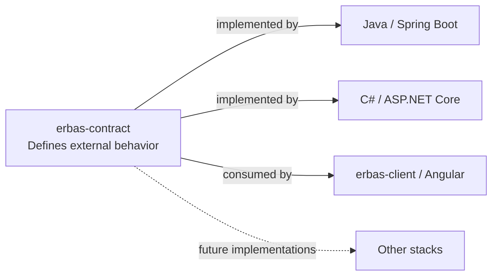

# ERBAS Contract

> One executable contract. Multiple interchangeable implementations.

[](LICENSE)
Java backend CI: [](https://github.com/alxarafe/erbas/actions/workflows/ci.yml)
.NET backend CI / shared conformance: [](https://github.com/alxarafe/alxarafe-dotnet/actions/workflows/ci.yml)
Angular client CI: [](https://github.com/alxarafe/erbas-client/actions/workflows/ci.yml)

[](docs/versioning.md)
[](openapi/erbas.yaml)
[](bruno/)
[](docs/usage.md)

ERBAS Contract defines one observable HTTP API for independent backend stacks
and a shared client. OpenAPI specifies the behavior; one Bruno collection checks
it against a supplied URL, keeping implementation details outside the contract.

## ERBAS ecosystem



| Repository | Responsibility | Current status |
| --- | --- | --- |
| [erbas-contract](https://github.com/alxarafe/erbas-contract) | Shared OpenAPI and sole Bruno conformance collection | Health, AUTH-001 and USERS-001 specified; no published release |
| [erbas](https://github.com/alxarafe/erbas) | Java/Spring Boot backend implementing Health and AUTH-001 | AUTH-003 completed; local conformance recorded; Java CI does not run shared Bruno |
| [alxarafe-dotnet](https://github.com/alxarafe/alxarafe-dotnet) | .NET backend implementing Health and AUTH-001 plus platform modules | AUTH-002 completed; CI includes shared Bruno against the pinned draft |
| [erbas-client](https://github.com/alxarafe/erbas-client) | Angular 22 client consuming Health and AUTH-001 from either backend | WEB-001 and WEB-002 completed and merged; real dual-backend demo verified |

Backends own their builds and isolated test infrastructure; this repository
owns the shared contract. The client works against either backend through its
same-origin Nginx proxy, keeping each opaque token only in memory.

## Quick start

```bash
./bin/check
# Export disposable enabled-admin ERBAS_TEST_EMAIL and ERBAS_TEST_PASSWORD first:
./bin/test URL
```

`./bin/check` validates OpenAPI and verifies the runner using synthetic servers.
`./bin/test URL` validates OpenAPI and checks the already running service at URL.

USERS-001 conformance mutates users and requires an isolated disposable environment.
Both run through Docker; see [usage and networking](docs/usage.md).

See [development ports](docs/development-ports.md) for local infrastructure conventions.

## Current contractual coverage

```text
GET /health
200 application/json
{"status":"ok"}
```

This public probe only establishes HTTP process liveness, not PostgreSQL or
dependency health; exact response rules are in [OpenAPI](openapi/erbas.yaml).

AUTH-001 adds `POST /api/auth/login`: email/password JSON, a minimal access-token
response, and distinct 400/401 errors. See [AUTH-001](docs/auth-001.md) for the
contract and test credentials; its dated compatibility review records historical
adaptation requirements. Both backends now implement AUTH-001. Java demonstrated
conformance against its pinned revision in
[AUTH-003 local verification](https://github.com/alxarafe/erbas/blob/main/docs/verification/auth-003.md);
.NET runs shared Bruno in its validation/CI workflow. The contract alone cannot
guarantee a backend's future conformance: consult each workflow badge and its
linked evidence. Java CI is general backend CI, not shared-contract conformance;
Angular client CI checks the client and isolated runtime proxies, while the
[real dual-backend demo](https://github.com/alxarafe/erbas-client/blob/main/docs/full-stack-development.md#web-002-integration-verification-2026-10-09)
provides separate integration evidence.

USERS-001 adds `/api/auth/me` and administrator-only user list, get, create and
update operations. Disabled users cannot authenticate or retain access. See
[USERS-001](docs/users-001.md) for the minimal model and rules. Backend and client
implementation of this new draft remains pending.

## Documentation and next steps

Start with the [documentation index](docs/README.md) for usage, decisions,
verification evidence, versioning, and working rules.

No contract release is published; `0.3.0` is the USERS-001 draft. Backend workflows and
their shared-contract coverage are described in the [documentation index](docs/README.md#verification-badges).
Published-version consumption remains planned; see the [versioning policy](docs/versioning.md).

## License

Copyright (c) 2026 Alxarafe. Licensed under [Apache-2.0](LICENSE).
