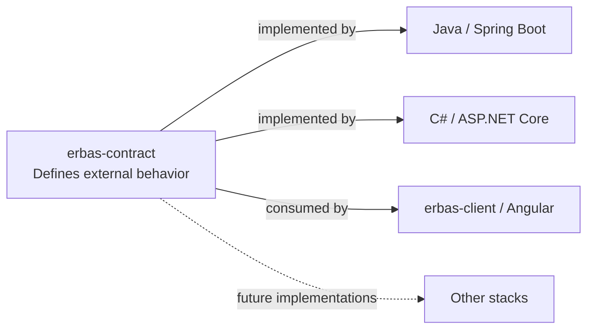

# ERBAS Contract

> One executable contract. Multiple interchangeable implementations.

[](LICENSE)
[](https://github.com/alxarafe/erbas/actions/workflows/ci.yml)
[](https://github.com/alxarafe/alxarafe-dotnet/actions/workflows/ci.yml)

[](docs/versioning.md)
[](openapi/erbas.yaml)
[](bruno/)
[](docs/usage.md)

ERBAS Contract defines one observable HTTP API for independent backend stacks
and a shared client. OpenAPI specifies the behavior; one Bruno collection checks
it against a supplied URL, keeping implementation details outside the contract.

## ERBAS ecosystem



| Repository | Responsibility | Current status |
| --- | --- | --- |
| [erbas-contract](https://github.com/alxarafe/erbas-contract) | Shared specification and conformance suite | Foundation verified, unreleased |
| [erbas](https://github.com/alxarafe/erbas) | Java/Spring Boot implementation | Local conformance recorded; CI does not run shared Bruno |
| [alxarafe-dotnet](https://github.com/alxarafe/alxarafe-dotnet) | C#/ASP.NET Core implementation | CI includes shared Bruno against a pinned draft |
| [erbas-client](https://github.com/alxarafe/erbas-client) | Shared Angular client | Not implemented yet |

Backends own their builds and isolated test infrastructure; this repository
owns the shared contract. The client is intended to work against either backend.

## Quick start

```bash
./bin/check
# Export disposable ERBAS_TEST_EMAIL and ERBAS_TEST_PASSWORD first:
./bin/test URL
```

`./bin/check` validates OpenAPI and verifies the runner using synthetic servers.
`./bin/test URL` validates OpenAPI and checks the already running service at URL.

Both run through Docker; see [usage and networking](docs/usage.md).

See [development ports](docs/development-ports.md) for local infrastructure conventions.

## Current contractual coverage

```text
GET /health
200 application/json
{"status":"ok"}
```

This public probe only establishes HTTP process liveness, not PostgreSQL or
dependency health; exact response rules are in [OpenAPI](openapi/erbas.yaml).

AUTH-001 adds `POST /api/auth/login`: email/password JSON, a minimal access-token
response, and distinct 400/401 errors. See [AUTH-001](docs/auth-001.md) for the
contract, test credentials and required backend adaptations. The new draft
does not establish current backend login conformance.

## Documentation and next steps

Start with the [documentation index](docs/README.md) for usage, decisions,
verification evidence, versioning, and working rules.

No contract release is published; `0.2.0` is the AUTH-001 draft. Backend workflows and
their shared-contract coverage are described in the [documentation index](docs/README.md#verification-badges).
Published-version consumption remains planned; see the [versioning policy](docs/versioning.md).

## License

Copyright (c) 2026 Alxarafe. Licensed under [Apache-2.0](LICENSE).
